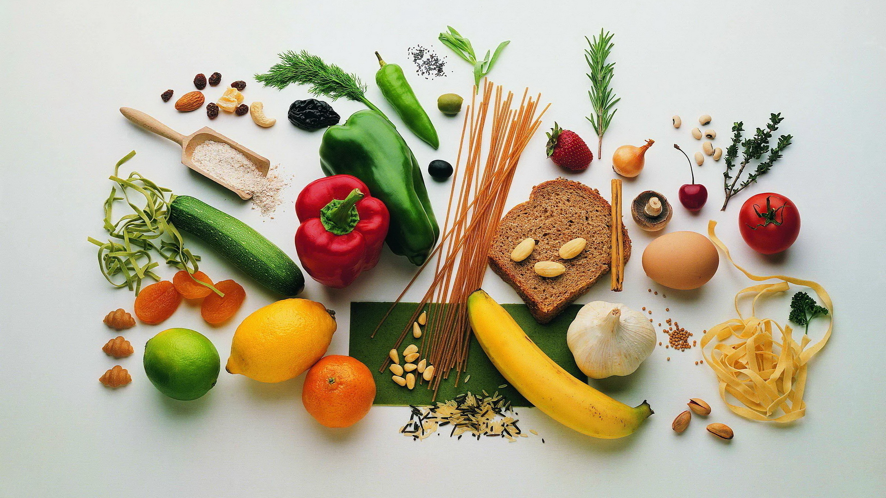

## Board Slides for FoodWheel
***

## Overview
FoodWheel is a startup delivery service that takes away the struggle of deciding where to eat! FoodWheel picks you an amazing local restaurant and lets you order through the app. Senior leadership is getting ready for a big board meeting, and as the resident Data Analyst, you have been enlisted to help decipher data and create a presentation to answer several key questions.

## Project Goals
The goal of this project is to use your pandas and matplotlib skills to analyze and visualize the FoodWheel dataset.

Some questions that are posed:

- What cuisines does FoodWheel offer? Which areas should the company search for more restaurants to partner with?
- How has the average order amount changed over time? What does this say about the trajectory of the company?
- How much has each customer on FoodWheel spent over the past six months? What can this tell us about the average FoodWheel customer?

## Actions

- analyze data;
- clean up the datasets;
- visualize the data using graphs and charts;
- seek to answer the questions;
- making conclusions based on the analysis.

## Data

There are two datasets:
1. restaurants.csv - contains information about different restaurants.
2. orders.csv - contains records of customer orders, including the date, restaurant, and order amount.

## Analysis

In this section, we will perform data analysis using pandas and matplotlib to answer the questions posed above.